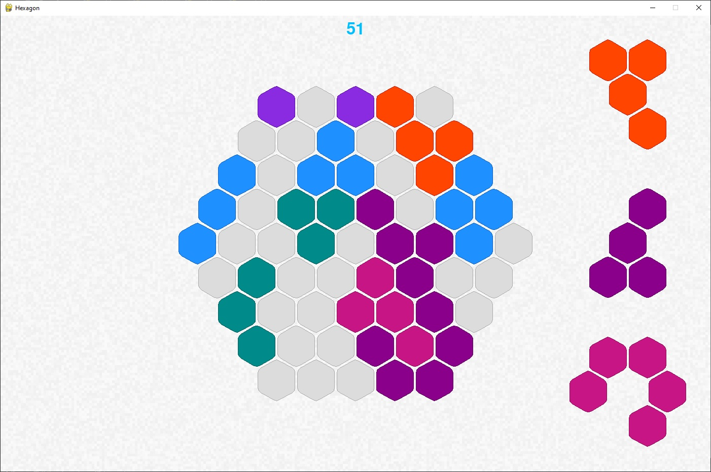
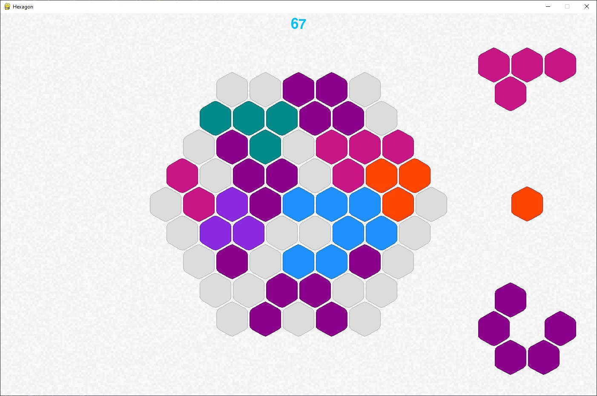

# Hexagon
Игра Hexagon

Hexagon - игра, на которую я случайно наткнулся в интернете и решил повторить на Python (с использованием библиотеки pygame). Правила игры немного напоминают правила Тетрис.
На игровом поле также нужно выстраивать полные линии, выкладывая фигурки, чтобы удалить их, с той лишь разницей, что поле в Hexagon состоит не из квадратиков, а из шестиугольных ячеек - гексов - и фигурки не падают сверху, а выбираются из случайным образом пополняемого "пула"

